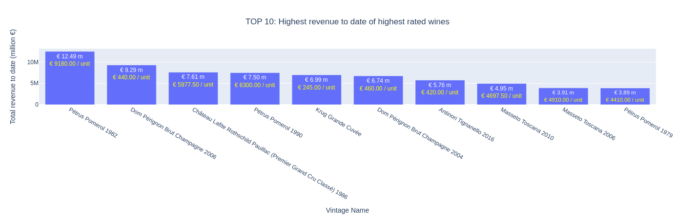
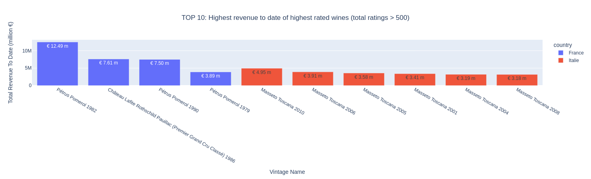
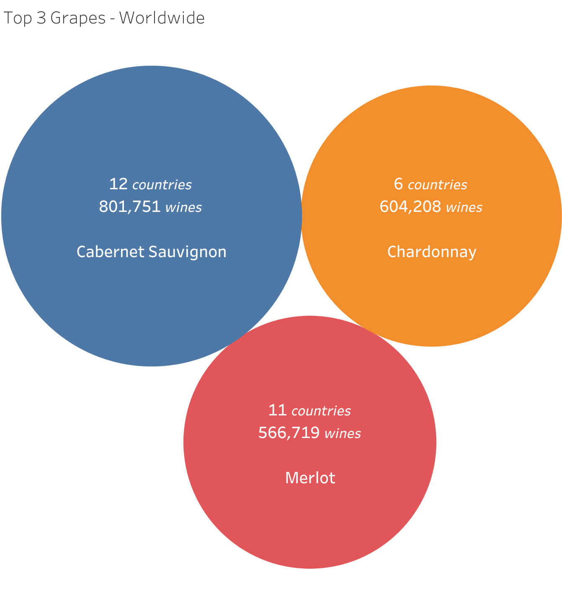
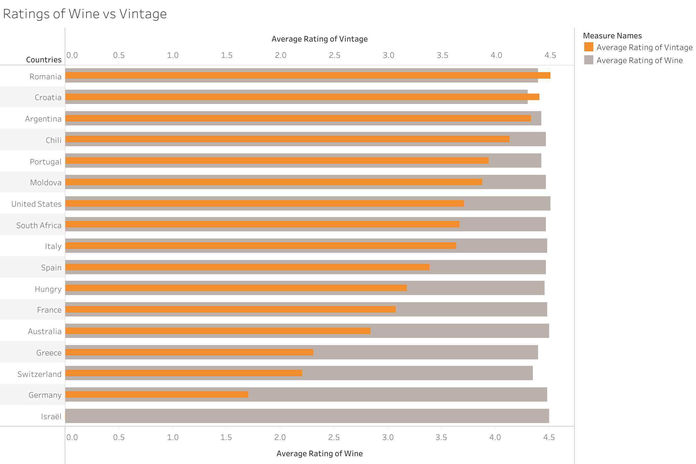
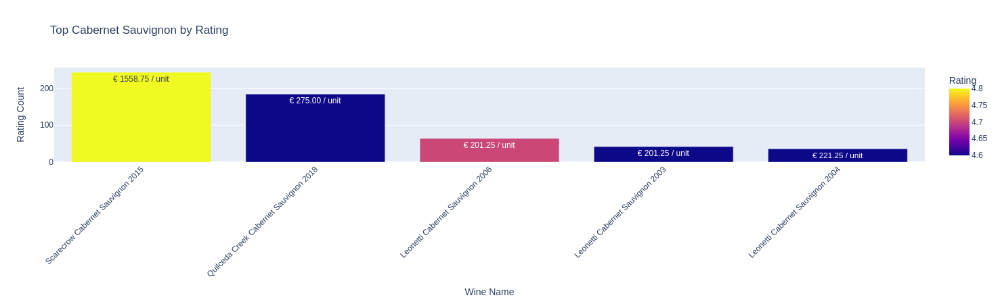

# :wine_glass: Vivinio Project :wine_glass:

## :page_with_curl: Installation :page_with_curl:

Start the application by running the following commands:
Make sure you have python 3.10 or 3.11 installed
```
pip install -r requirements.txt
```
```
streamlit run streamlit.py
```

## Database schema
We have analysed the database called 'vivino.db'. The schema can be found below:


## Assumption
We have assumed that the amount of ratings of the wines have been posted by clients that have bought the wine thourgh the webshop. Therefor we calculated the revenue to date by multiplying the 'rating_counts' by the price of the wine.


## Market Analysis

### **1) We want to highlight 10 wines to increase our sales. Which ones should we choose and why?**



We would like to recommmend the wines presented in the graph below. To increase sales we want to look at the wines that have brought in the most revenue date. Obviously this approach is speculative but does give us a good insight on what wines can give us a big spike in sales if marketed properly.

The **Petrus Pommerol 1982** stands out because of it's high sale price (91800 euros per unit) but given the fact that it has a high overall rating (4.7) out of 1361 reviews we can assume this wine is a must buy for who can afford it. A total revenue of € 12 million makes it jump out in comparison to the other wines.

A close competitor when it comes to total revenue is the **Dom Pérignon Brut Champagne 2006** with a revenue of **€ 9.25 million**. With a reasonable buy price of €440. This wine is more accessible to the public. This accessibility is clear with a total average rating of 4.6 out of 21121 reviews.

We can see that the more affordable top rated wines have a big revenue stream. The **Krug Grande Cuvée** brings in **€ 6.9 million**. with a massive amount of 28513 reviews and an affordable price of € 245.

We decided to take into account not only the premium vintages but also vintages that are affordable for everyone who wants to enjoy globally top rated wines.


### **2) We have a marketing budget for this year. Which country should we prioritise and why?**

    We have identified the wines that have the most revenue and are the best rated (and most rated). There are only 2 countries that produce these wines: **France** and **Italy**. Our suggestion would be to invest heavily in the marketing of these premium French wines, and if the marketing budgets allows, include the Italian wines. Especially the Masseto Toscana vintages bring in a high revenue.


### **3) We would like to give awards to the best wineries. Come up with 3 relevant ones. Which wineries should we choose and why?**
:exclamation: The answer to this question cannot be answered using this dataset. We have no relevant data on the wineries, that's why cannot answer this question :exclamation:


### **4) We have detected that a big cluster of customers like a specific combination of tastes. We have identified a few primary keywords that match this. We would like you to find all the wines that have those keywords. To ensure the accuracy of our selection, ensure that more than 10 users confirmed those keywords. Also, identify the group_name related to those keywords. The keywords in question are [coffee, toast, green apple, cream, citrus]**


We have grouped the keywords into taste groups and have visualised the percentages per taste group. It's clear that the **[oak, non oak, microbio]** combination is very popular as it consists of about 39.9% of the taste groups, close second is the **[oak, microbio]** combo (25%) followed by the **[citrus_fruit, microbio]** group.

### **5) We would like to select wines that are easy to find all over the world. Find the top 3 most common grape all over the world and for each grape, give us the the 5 best rated wines.**
:exclamation: The full answer to this question cannot be given, because there is no direct link between the grape type used in the wines. There is however a link between the grape type and the top 3 of grapes used in a certain country. :exclamation:

Below you can find the top 3 grapes used worldwide and the amount of wines that are produced per type of grape.
Cabernet Sauvignon is clearly the most popular grape used in the wine industry all over the world. About 800,000 different wines are using Cabernet Sauvignon as it's sole grape or in combination with other grapes. Close second is the Merlot grape that is being used in 11 countries and counts about 566,719 different wines. The bronze medal goes to the Chardonnay variant which is being used in 6 countries and counts about 604,208 wines.


### **6) We would to give create a country leaderboard, give us a visual that shows the average wine rating for each country. Do the same for the vintages.**


The closest relation between the wines created in a country and the vintages of that country are to be found in **Romania**, **Croatia** and **Argentina**. For these 3 countries the average rating of the vintages and the average rating of the wines produced is pretty much equal.

Thie biggest difference in this list are the wines from **Germany** (which have an average rating of Vintages of about 1.7 and an average rating for wines of about 4.48). 

We can assume that the date on Isreal is either incomplete or incorrect.

### **7) One of our VIP client likes Cabernet Sauvignon and would like our top 5 recommendations. Which wines would you recommend to him?**


We would recommend the **Scarecrow Cabernet Sauvignon 2015**. It is highly ranked and the reviews are stellar (4.8 out of 5 from 243 ratings).
The line of Cabernet Sauvignons from **Leonetti** should be taken into account as well. The years 2003, 2004 and 2006 are regarded one of the highest rated wines and have an affordable price of €201.25, €221.25, €201.25 respectively.